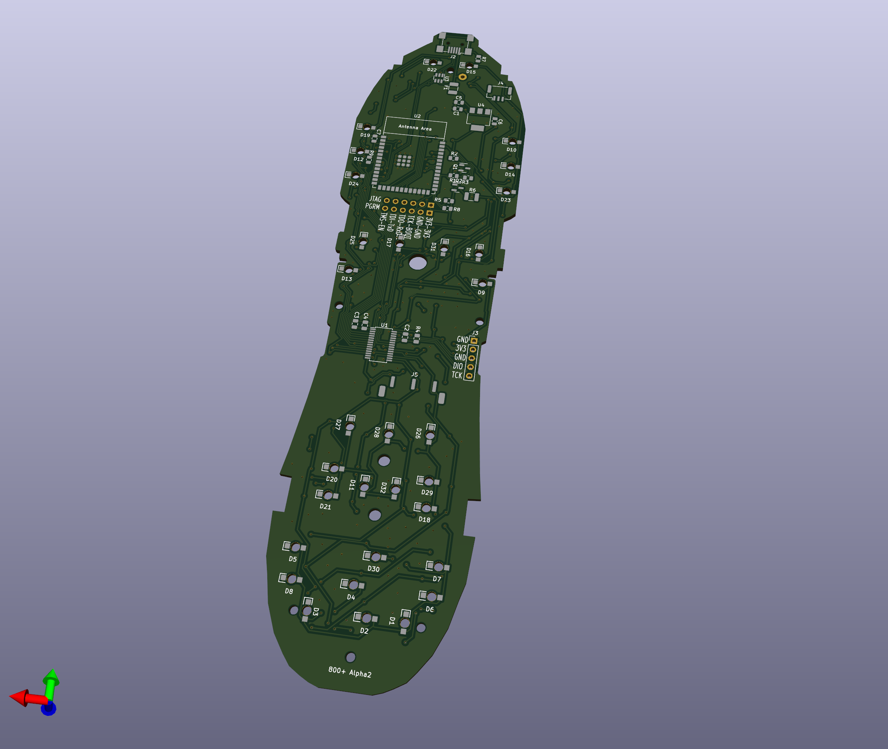

# Alpha2 PCB

Updated the Kicad project for another alpha PCB.  Two layer PCB again but 0.8mm thick to fully test fitup with case.

* Fixed mosfet for the button led backlight
* Put an ESP32-S3 module on the board.
* USB wired up to the ESP32, 3.3V supply from the usb 5V.

# Alpha PCB

Kicad files for the alpha PCB.  Overall dimensions were okay.  The sides by the LCD might need trimmed down a smidge but there isn't much room for the button contacts.

Two layer PCB to keep cost down.  I ordered a 1.6mm thick but the stock board was 0.8mm so the case wouldn't snap shut properly.

##### Bare Screen

https://www.alibaba.com/product-detail/Lcd-Screen-Display-2-Inch-240x320_1600053711661.html

##### 4mm dome switches

https://www.aliexpress.us/item/2255799854582341
